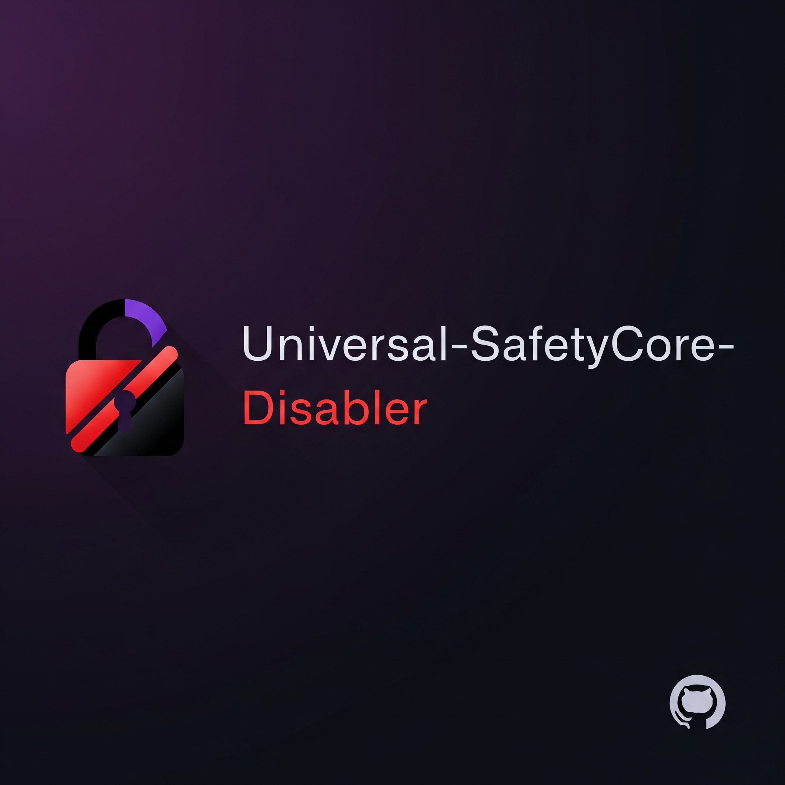

  

<h1 align="center">Universal SafetyCore Disabler</h1>

  <strong>By ARASAKA</strong>

  
  
  
  
  

> In a world of constant data collection, ARASAKA believes in digital sovereignty.
> This module is a statement: the only one analyzing your data should be **YOU**.

---

### **Take Back Control. System-wide.**

**Universal SafetyCore Disabler** is not just a utility; it's a philosophy. This Magisk module provides a robust, fully-automated method to completely disable Google SafetyCore on any Android device, replacing it with a harmless, non-functional placeholder.

Most importantly, it prevents the Google Play Store from re-installing or updating the service, giving you **THE FULL CONTROL.**

### ✨ Core Features

* **🛡️ Universal Disabler:** Intelligently detects and disables SafetyCore whether it's a pre-installed **System App** or a user-installed app from the Play Store.
* **✍️ Signature Protection:** The placeholder app uses a different signature, making it impossible for the Play Store to overwrite it with an official update.
* **🖥️ Modern WebUI:** Manage the module via a sleek, intuitive Web User Interface. Check the module's status and revert changes with a single tap.
* **🤖 "Reboot-to-Restore" Automation:** To revert a user-installed app, the module uses a powerful boot-time script (`service.sh`) to reliably restore the official version, bypassing runtime security restrictions.
* **📲 Auto-Installer for WebUI:** If a compatible WebUI host app isn't found, the module will offer to download and install one for you by itself when using the Action button on Magisk or other methods you use.

---

### ❓ Frequently Asked Questions

  
<strong>What exactly is Google SafetyCore?</strong>

  
It's a system service that is part of Google's 'Private Compute Core'. It performs on-device AI tasks like generating Live Captions for media, powering "Now Playing" song recognition, and, most notably, scanning your photos and messages to provide 'sensitive content warnings'.

  
<strong>Why should I disable it?</strong>

  
While some features are useful, the framework has deep access to your personal data. Disabling it is a proactive step towards ensuring your data is not being processed or analyzed by any service without your explicit, active consent. This module is for users who prioritize privacy and control above all else.

  
<strong>Is this process safe?</strong>

  
Yes. The process is completely systemless. The advanced installation and uninstallation logic ensures that your device remains stable at all times. For "User App" mode, the official bundled APK is restored perfectly. For "System App" mode, it uses Magisk's safe overlay feature.

  
<strong>How do I revert the changes?</strong>

  
That depends on how the module disabled the app on your specific device:

  <ul>
    <li><strong>If it was a User App:</strong> Simply use the "Uninstall & Revert" button in the module's WebUI. It will schedule a task, and upon rebooting, the official app will be automatically restored.</li>
    <li><strong>If it was a System App:</strong> The WebUI will inform you that the only safe way to revert is to uninstall the entire module from the Magisk app and then reboot.</li>
  </ul>

---

### 💾 Installation

1.  Download the latest release `.zip` from the **[Releases](https://github.com/ARASAKA69/Universal-SafetyCore-Disabler/releases)** page.
2.  Open the **Magisk** app **Or any other you use** > **Modules** tab.
3.  Tap **"Install from storage"** and select the downloaded `.zip` file.
4.  Reboot your device.

### 🚀 Usage

1.  In Magisk/ap/ksu, find the **Universal SafetyCore Disabler** in your module list.
2.  Tap the **"Action"** button to launch the WebUI.
3.  From the UI, check the status or initiate the revert process.

---

### 🙏 Acknowledgements

This module stands on the shoulders of giants. Our sincere thanks go out to the following developers for their foundational work and inspiration:

* **@daboynb** for providing the original open-source [placeholder application](https://github.com/daboynb/Safetycore-placeholder).
* **5ec1cff** for creating the standalone [KSUWebUI Host App](https://github.com/5ec1cff/KsuWebUIStandalone), which makes a modern UI like this possible for all users.

